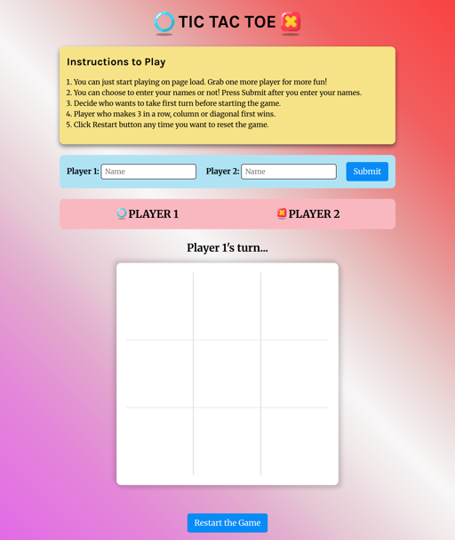
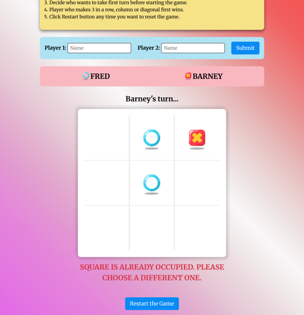
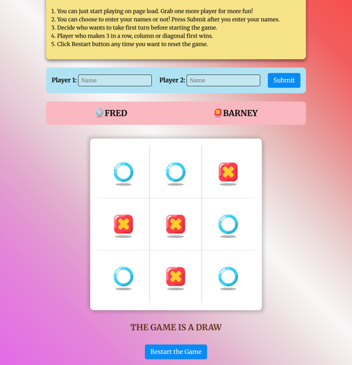
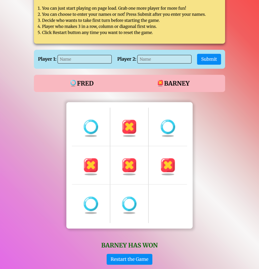

# The Odin Project - Tic Tac Toe solution

This is a solution for the [Tic Tac Toe project on The Odin Project](https://www.theodinproject.com/lessons/node-path-javascript-tic-tac-toe)

## Table of contents

- [The Odin Project - Tic Tac Toe solution](#the-odin-project---tic-tac-toe-solution)
  - [Table of contents](#table-of-contents)
  - [Overview](#overview)
    - [Screenshots](#screenshots)
    - [Links](#links)
    - [Useful resources](#useful-resources)
  - [Acknowledgments](#acknowledgments)

## Overview

Tic Tac Toe is a simple, two-player game played on a 3x3 grid. In this project players can choose to enter their names or they can play anonymously, and the game will start with the first player. Players take turns marking a square with either an X or an O. The objective of the game is to be the first to get three of your marks in a row, either horizontally, vertically, or diagonally. If all squares are filled and no player has won, the game ends in a draw. There is also a reset button any time the player wants to restart the game.

### Screenshots

<table>
  <tr>
    <td align="center"> <em>Laptop Design</em></td>
    <td align="center"> <em>Laptop Error State</em></td>
  </tr>
  <tr>
    <td align="center"> <em>Laptop Draw State</em></td>
    <td align="center"> <em>Laptop Win State</em></td>
  </tr>
</table>

### Links

- Solution URL: [https://github.com/py-code314/tic-tac-toe](https://github.com/py-code314/tic-tac-toe)
- Live Site URL: [https://py-code314.github.io/tic-tac-toe/](https://py-code314.github.io/tic-tac-toe/)

### Useful resources

1. [CSS Reset](https://www.joshwcomeau.com/css/custom-css-reset/) by Josh Comeau
2. [Gradient Generator](https://www.joshwcomeau.com/gradient-generator/) by Josh Comeau
3. Icons from [icons8.com](https://icons8.com/icons)

## Acknowledgments

1. [Blue circle icon](https://icons8.com/icon/pqdu3v0h2ilE/circle) from icons8
2. [Yellow cross icon](https://icons8.com/icon/JBdPHdFxWGru/close-window) from icons8
3. I'd also like to thank [Josh Comeau](https://www.joshwcomeau.com/) for his excellent articles on CSS and JavaScript.
